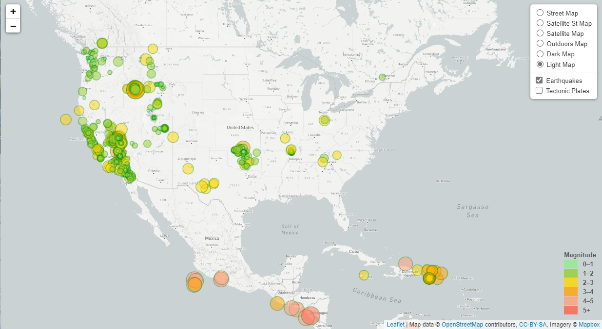
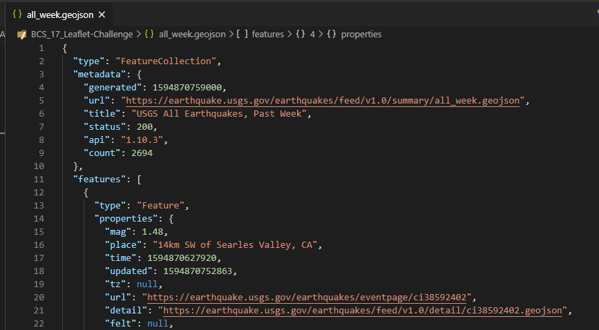
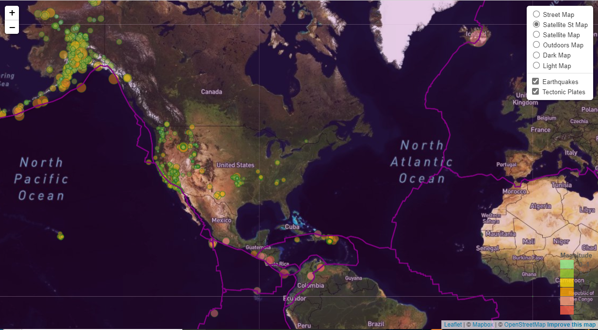

# BCS_17_Leaflet-Challenge Submission

Earthquake Leaflet Homework

https://sanjive.github.io/BCS_17_Leaflet-Challenge/index.html

# Leaflet Homework - Visualizing Earthquake Data with Leaflet

Earthquake map vizualization with past week of data from USGS. the GeoJSON file retrieved from USGS is used to plot the earthquake.
The Earthquake are represented as circle with magnitude from 0 through 5 and above. The world map also displays various layers of mpa and overlays these layers with the faultline map.

# Tasks:
### Level 1: Basic Visualization

1. **Getting the GeoJSON data from USGS web site**

   

   The USGS provides earthquake data in a number of different formats, updated every 5 minutes. Pull the 'All Earthquakes from the Past 7 Days' GeoJSON data from [USGS GeoJSON Feed](http://earthquake.usgs.gov/earthquakes/feed/v1.0/geojson.php) and get the page and pick a data set to visualize.

2. **Import & Visualize the Data**

   Created a map using Leaflet that plots all of the earthquakes from the data set based on their longitude and latitude.

   - Data markers reflect the magnitude of the earthquake in their size and color. Earthquakes with higher magnitudes appear larger and darker in color.
   - Popups that provide additional information about the earthquake when a marker is clicked.
   - Created a legend that will provide context for the map data.
   - Your visualization like the first image above.

### Level 2: More Data (Optional)

Plotted the second data set on the map to illustrate the relationship between tectonic plates and seismic activity. This second data set is set to be vizualized it along side the original set of data. Data on tectonic plates was retrieved from <https://github.com/fraxen/tectonicplates>.

- Plotted the second data set on the map.
- Added a number of base maps to choose from as well as separate out the two different data sets into overlays that can be turned on and off independently.
- Added layer controls to our map.
